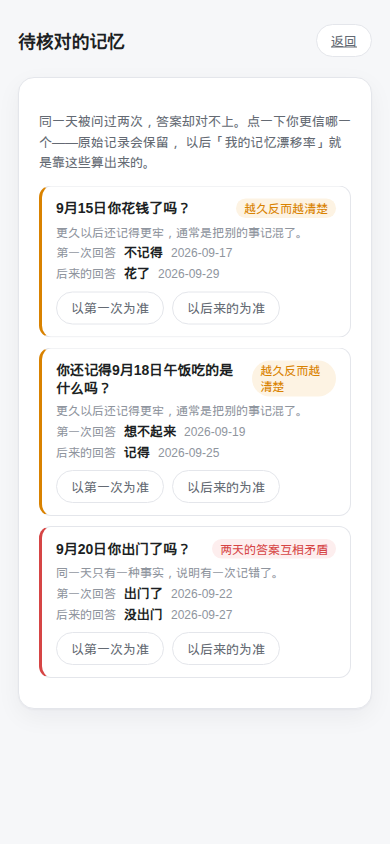

# 每日回忆 · Daily Recall

[English](README.md) · **中文说明**

**每天五道题，问的昨天。**

<p align="center">
  
  
  
</p>

多数记忆 App 让你背「你想记住的东西」的卡片。每日回忆问的是**昨天**——你吃了什么、有没有出门、和谁说过话——然后过几天，再问一遍同一天。

第二次提问才是关键：

| 提问当天 | 题干显示 | 实际问的是哪一天 |
|---|---|---|
| 9-21 | 你**昨天**出门了吗？ | 9-20 |
| 9-22 | 你**前天**出门了吗？ | 9-20 |
| 9-27 | 你**一周前那天**出门了吗？ | 9-20 |

同一个日子被问了三次。答案对不上的时候，那不是「做题分数」，而是关于你记忆如何漂移的证据。

## 它和别的记忆 App 有什么不同

- **跨天一致性校验**：周二回答「出门了」、周三回答「没出门」，指的是同一个周一，程序会把它标出来。原始答案**永不覆盖**——「第一次答错了」本身就是最有价值的数据。
- **不一致分三类，而不是一类**：事实互相矛盾 = 记错了；以前记得、后来忘了 = 正常遗忘，应该画成曲线而不是报警；**越久反而越清楚**（忘了 → 记得）= 最可疑的一种，通常是虚构或混淆。
- **事实题顺手变成日记**：用上几个月，你就得到一份自动写好的记录——哪天吃了什么、去了哪，全是练习的副产品。
- **本地优先，零后端**：不要账号、没有服务器、不跟踪。数据只在浏览器的 `localStorage` 里，一键导出导入。
- **锚点题**：每次练习里有几道题不计分，它们是「钩子」。「昨天下雨了吗」不是在考你，而是把当天的其他记忆勾出来。

## 快速开始

```bash
npm install
npm run dev          # http://localhost:3000
```

或者用 Docker 跑静态版：

```bash
docker compose up -d --build     # http://localhost:4470
```

构建产物是纯静态站点（`out/`），可以丢到任何静态托管上——GitHub Pages、Cloudflare Pages、Netlify，或者一个普通 nginx。没有服务端代码，没有数据库。

### 常用命令

```bash
npm run questions:build   # 把 questions/*.yaml 编译成 src/generated/questions.json
npm test                  # 单元测试 + 题库校验
npm run typecheck
npm run build             # 构建（服务端模式）
```

## 三种运行模式

同一份代码，靠配置决定跑到哪一档。**什么都不配也能用**：

| 模式 | 怎么开 | 得到什么 |
|---|---|---|
| 纯本地 | 默认 | 数据只在自己浏览器里，不要账号、不要数据库 |
| 本地 + 账号 | 配 `DATABASE_URL` | 邮箱密码或 OIDC 登录、云端同步、题目反馈 |
| 只要其中一部分 | `AUTH_ENABLED=false` 等 | 例如只要反馈不要账号，或反之 |

```bash
cp .env.example .env    # 按需填，全留空也能跑
docker compose up -d --build
```

### 环境变量

| 变量 | 作用 |
|---|---|
| `DATABASE_URL` | 配了才启用服务端；不配就是纯本地模式 |
| `AUTH_ENABLED` | 是否允许注册登录（默认跟随服务端） |
| `FEEDBACK_ENABLED` | 是否接受题目反馈（默认跟随服务端） |
| `PUBLIC_URL` | 站点公网地址，OIDC 回调地址靠它拼，必须与 provider 登记的一致 |
| `ADMIN_EMAILS` / `ADMIN_GROUPS` | 谁能进题目管理后台 |
| `OIDC_ISSUER` / `OIDC_CLIENT_ID` / `OIDC_CLIENT_SECRET` | 可选的统一登录 |
| `AUTH_PASSWORD_ENABLED` | 是否保留邮箱密码注册（关掉则只走 OIDC） |

### 接自己的统一登录（OIDC）

不绑定任何厂商，Authentik / Keycloak / Auth0 / Google 都一样，填三个变量即可：

```bash
PUBLIC_URL=https://memory.example.com
OIDC_ISSUER=https://auth.example.com/application/o/memory/
OIDC_CLIENT_ID=xxxxxxxx
OIDC_CLIENT_SECRET=xxxxxxxx
```

在 provider 里把回调地址登记为 `https://memory.example.com/api/auth/oidc/callback`。
如果 provider 用组来管理权限，把管理员组名写进 `ADMIN_GROUPS` 就能直接用后台。

### 数据放在哪

- **浏览器**：永远是第一份数据。断网、没登录、数据库挂掉，都不影响继续答题。
- **数据库**：登录后的另一个副本。同步就是把两边合一下——作答记录不可变且带 UUID，
  所以合并只是集合并集，不需要处理冲突。
- 没配数据库时，上面那条链路完全不参与，行为和最初版本一模一样。

## 代码结构

```
questions/*.yaml        题库——这个项目真正的主体，社区可以直接改
src/lib/date.ts         日期锚定（把「昨天」解析成 2026-09-20）
src/lib/pick.ts         组题：新鲜题 + 少量复习题 + 锚点题
src/lib/drift.ts        跨天一致性检测
src/lib/scoring.ts      按偏移天数加权的回忆覆盖率
src/lib/storage.ts      localStorage 持久化与导出导入
```

`src/lib/` 下全部是纯 TypeScript，不依赖任何框架，都有单元测试。想把这套逻辑搬到别处用，拿走这部分就行。

### 关于评分

回忆覆盖率不等于正确率。记住 30 天前的事，比记住昨天更值钱；10 题全对也不该和 5 题全对同分。具体规则见 `src/lib/scoring.ts` 里的 `offsetWeight()`。

## 贡献题目

题库是这个项目最有价值的部分，也是最容易贡献的部分。先读 **[docs/question-guide.md](docs/question-guide.md)**——它讲清了什么样的题有效（以及有多少种写出坏题的方式），然后在 `questions/zh-CN.yaml` 里加条目，跑 `npm test`。

测试会强制三条规则：

1. **选项穷举且互斥**，用户永远不需要打字。
2. **每道 fact 题必须有「不记得」出口**。没有出口，人就会瞎猜，而瞎猜比诚实承认「忘了」的数据更脏。
3. **ID 与语言无关且稳定**。翻译题目不能改 ID。

## 多语言

UI 文案表已支持 `zh-CN` 与 `en`，题库格式本身也是按 locale 组织的。欢迎补充英文题库 `questions/en.yaml`，见 [CONTRIBUTING.md](CONTRIBUTING.md)。

## 当前状态

v2 加了可选的服务端：账号、云端同步、题目反馈。三者都由配置开关控制，
默认关掉就回到 v1 的纯本地体验。想要纯静态托管（GitHub Pages 等）请用 `v1.0.0` tag。

## 许可

[MIT](LICENSE)
